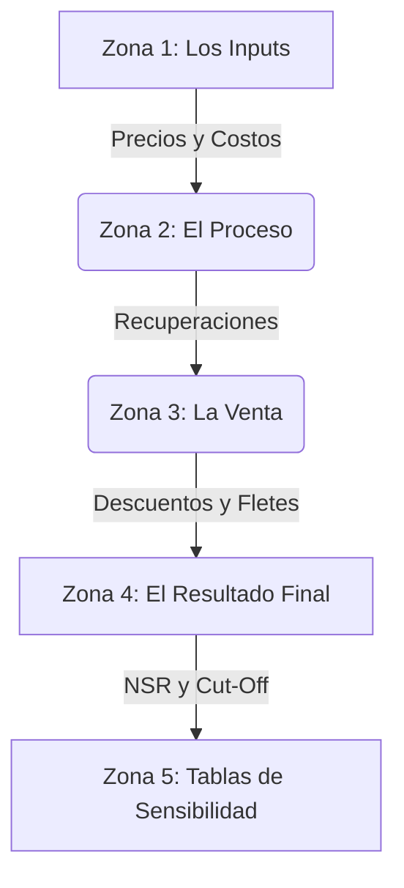

# 📘 Guía Maestra: Entendiendo el Modelo "CHOQUE"

Este documento es tu mapa para navegar por el archivo `01_CHOQUE_Prelim_Calcs_checks_AFJ_v01.xlsx`. El Excel no es solo una hoja de cálculo, es un **simulador de negocio** que responde a la pregunta: *"¿Cuánto dinero ganamos realmente por cada tonelada de roca?"*

---

## 🗺️ Mapa Mental del Archivo

Imagina que el archivo se divide en 4 grandes "Zonas":

---

## 🔍 Zona 1: Los Inputs (Filas 2-9)
**"Las reglas del juego"**
Aquí defines cuánto valen los metales en el mercado mundial y las conversiones físicas.
*   **Precios:** Au ($2500/oz), Ag ($28/oz), Cu ($4.00/lb).
*   **Factores:** Conversiones de Onzas a Gramos (31.1035) y Libras a Toneladas (2204.62).
    *   *Por qué importa:* Si cambias esto, cambia todo el modelo. Es la base de la pirámide.

---

## 🏭 Zona 2: El Proceso (Filas 44-63)
**"La Cocina: ¿Cómo procesamos la roca?"**
El modelo evalúa dos "recetas" o rutas para procesar el mineral. Whittle necesita saber cuál elegir para cada bloque.

| Característica | Ruta 1: LEACHING (Lixiviación) | Ruta 2: MILLING (Molienda/Flotación) |
| :--- | :--- | :--- |
| **Ideal para** | Minerales Oxidados (baja ley, fácil de tratar) | Minerales Sulfuros (alta ley, complejo) |
| **Costo ($/t)** | **$11.50** (Barato) | **$20.50** (Caro, gasta más energía) |
| **Recuperación Au** | **80%** (Pierdes un 20% del oro) | **90%** (Recuperas más oro) |
| **Producto Final** | **Cátodos / Doré** (Metal casi puro) | **Concentrado** (Polvo con metal y tierra) |

> **💡 Insight:** El Milling recupera más oro (90% vs 80%) y todo el cobre, pero cuesta casi el doble ($20.50 vs $11.50). El desafío de Whittle es calcular si el oro extra paga el costo extra.

---

## 💸 Zona 3: El Laberinto de Ventas (Filas 64-134)
**"Del Puerto al Bolsillo"**
Aquí es donde la mayoría se pierde. El precio del oro es $2,500, pero **tú nunca recibes $2,500**. Esta sección calcula todos los "peajes" que pagas en el camino.

### El viaje del Cátodo (Leach) - Filas 81-94
Es más directo. Vendes metal casi puro.
*   **Descuentos:** Fletes (camión + barco), Marketing, Refino.
*   **Golpe final:** De los $2,500, te descuentan unos **$145.48** por onza en costos de venta.

### El viaje del Concentrado (Mill) - Filas 111-134
Es más complejo. Vendes "tierra rica", no metal puro.
*   **Payable Factor (97.5%):** La fundición no te paga todo el oro que envías. Se queda con un 2.5% gratis.
*   **Maquilas y Deducciones:** Te cobran por fundir la tierra (TC/RC).
*   **Fletes:** Transportas mucha basura (tierra estéril dentro del concentrado), así que el flete es caro.
*   **Golpe final:** Te descuentan unos **$162.51** por onza.

> **Resumen para Whittle:**
> *   Precio Neto Leach = $2,500 - $145.48 = **$2,354.52 /oz**
> *   Precio Neto Mill = $2,500 - $162.51 = **$2,337.49 /oz**

---

## ⚖️ Zona 4: El Resultado (Cut-Off y NSR)
**"¿Vale la pena minar esto?"**

### NSR (Net Smelter Return) - Filas 137-138
Es el valor real de una onza de oro puesta en la mina, después de pagarle a todos (menos a la mina misma).
*   Fórmulas complejas que resumen todo lo anterior en un solo número por gramo o por onza.

### Cut-Off Grades (Leyes de Corte) - Filas 135-136
Es la nota mínima que necesita la roca para aprobar el examen.
*   **Marginal Cut-Off:** Cubre solo el proceso ($11.50 o $20.50). Si la roca paga esto, y ya está minada, se procesa.
*   **Mining Cut-Off:** Cubre proceso + minado ($3.50).

---

## 📊 Zona 5: La Tabla Gigante (Filas 152-182)
**"El Oráculo de Sensibilidad"**
Esta tabla (al final del Excel) es una matriz de **"Qué pasaría si..."**.

*   **Eje Horizontal (Arriba):** Diferentes Precios del Oro ($1,000 a $4,500).
*   **Eje Vertical (Izquierda):** Diferentes Leyes de Oro (0.10 g/t a 0.90 g/t).
*   **El Centro:** El Margen o Valor ($) por tonelada.

**¿Para qué sirve?**
Te permite ver rápidamente la robustez del proyecto.
*   Si el precio baja a $1,800, ¿qué ley necesito para ganar dinero? (Buscas donde el valor se vuelve positivo).
*   Es vital para definir los "Nested Pits" en Whittle, ya que te muestra cómo crece o se achica la reserva económica al variar el precio.

---

## 🚀 Resumen para tu Configuración Whittle

1.  **Mining Cost:** $3.50 (Ore/Waste)
2.  **Processing Cost:** $11.50 (Leach) | $20.50 (Mill)
3.  **Recoveries:** 80% (Leach) | 90% (Mill)
4.  **Selling Cost (Input como coste de venta):** $145.48 (Leach) | $162.51 (Mill)
    *   *Truco:* En Whittle, a veces es más fácil poner el precio *neto* (Price - Selling Cost) directamente, o usar el campo de "Selling Cost" por producto.
